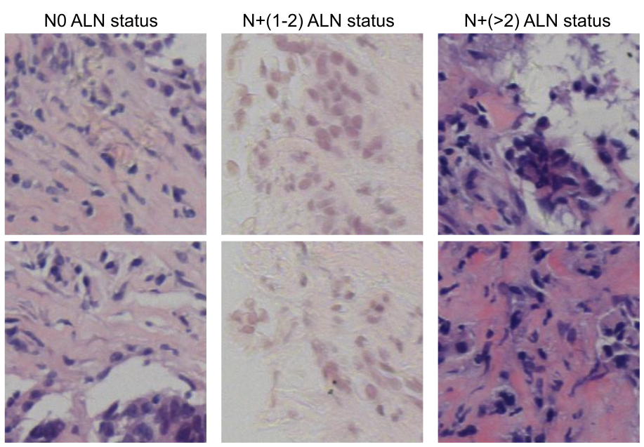
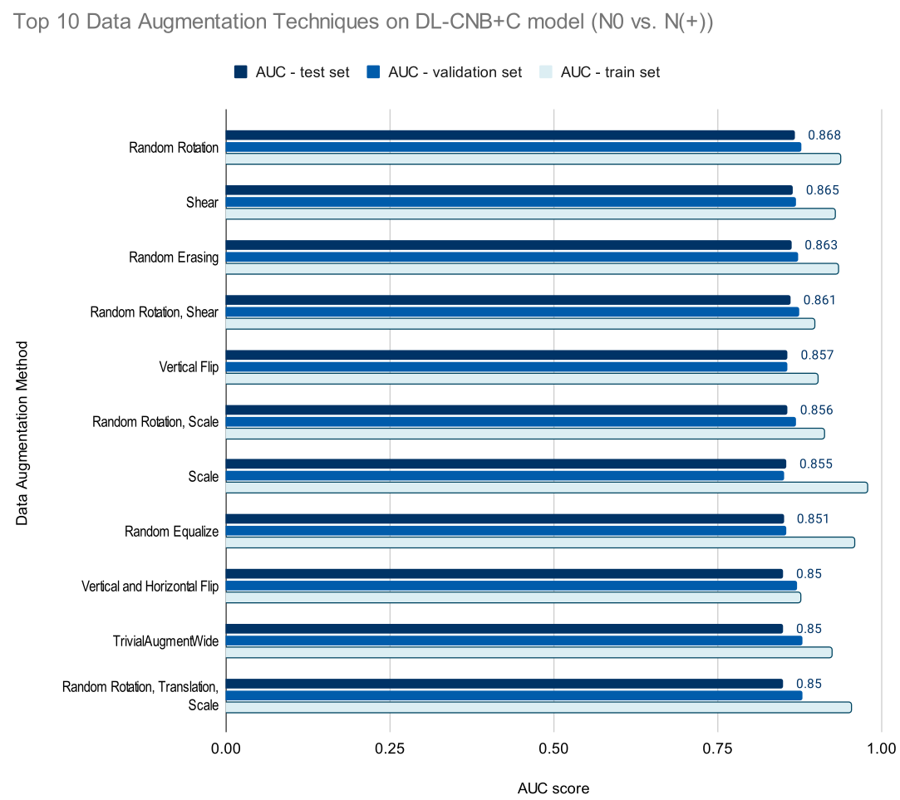
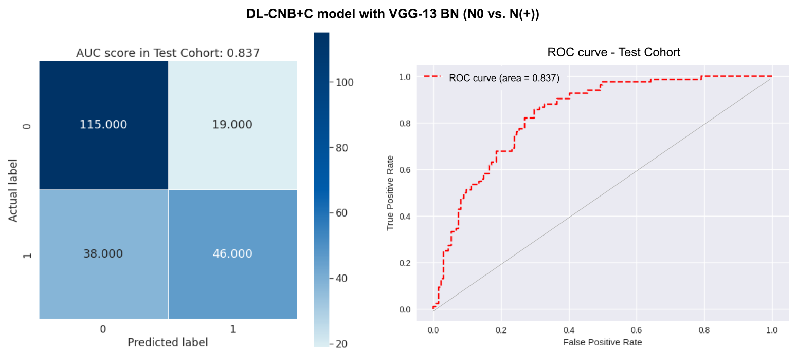
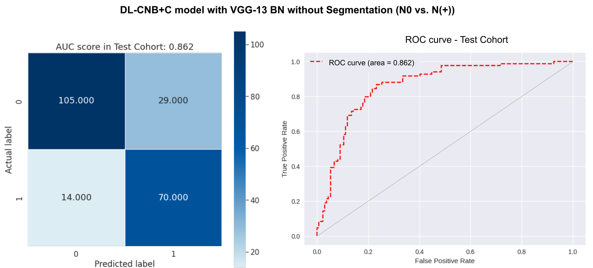
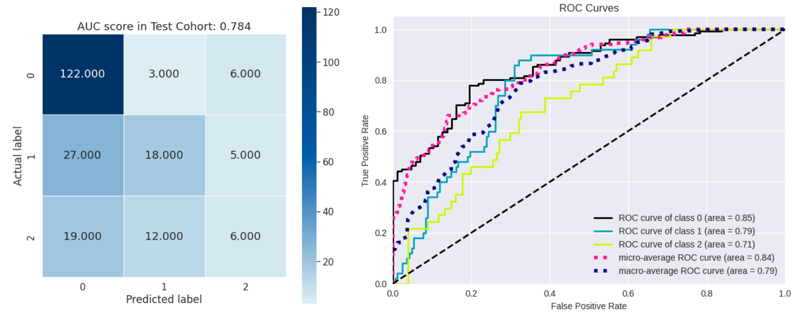

# BREAST CANCER DETECTION IN CORE-NEEDLE BIOPSIES WITH NEURAL NETWORKS

This repo is the official implementation of my paper "Breast cancer detection in core-needle biopsies with neural networks". 

## Abstract

Breast cancer has become the greatest threat to women's health worldwide. Clinically, identification of axillary lymph node (ALN) metastasis is important for evaluating prognosis and guiding  treatment. This paper aims at reproducing the results from [Xu et al. 2021](https://arxiv.org/abs/2112.02222), and further extends their deep learning classification pipeline by quantifying clinical information from core-needle biopsy images. We made use of a publicly available dataset of $1058$ patients. Different baseline state-of-the-art deep learning models were tested to estimate the metastatic status of ALNs. Subsequently, an extensive ablation study of different data augmentation techniques was performed. Lastly, tumor extraction and expert annotations were removed from the classification pipeline.  Our proposed model outperformed SOTA by 3.73 %. 
        
## Setup

### Clone this repo

```bash
git clone https://github.com/glejdis/CMT_code.git
```

### Environment

Create environment and install dependencies.

```bash
conda create -n DLCNBC python=3.9.12 -y
conda activate DLCNBC
pip install -r code/requirements.txt
```
        
 ### Dataset

For your convenience, we have provided preprocessed clinical data in `code/dataset`. The processed WSI patches can be downloaded from [here](https://drive.google.com/file/d/1wY5KIVixdwzZZq2m0IoqmBLp0YlwBAz6/view?usp=sharing) and unzip them by the following scripts:

```bash
cd code/dataset
# download paper_patches.zip
unzip paper_patches.zip
```

Illustration of exemplary patches from each class of the BCNB dataset: 
<p align="center"></p>

## Training

To train our models run the following:

> experiment_index:
> 
> 0. N0 vs N+(>0)
> 2. N0 vs N+(1-2) vs N+(>2)

To run any experiment of the DLCNB with the clinical data, you can do as this:

```bash
cd code
bash run.sh ${experiment_index}
```

To run any experiment of the DLCNB without the clinical data, you can do as this:

```bash
cd code
bash run_no_clinical.sh ${experiment_index}
```

To run any experiment of the DLCNB with the clinical data and data augmentation strategies, you can do as this:

```bash
cd code
bash run_further_data_aug.sh ${experiment_index}
```

Furthermore, if you want to try other settings, please see `train.py` for more details.

## Results

Some of the best results obtained from our experiemnts are given in folders `plots`, `plots_no_clinical`, `plots_no_Segmentation` and `logs`.

The overall performance results in terms of AUC score of top 10 data augmentation techniques in the prediction of ALN status: DL-CNB+C model (N0 vs. N(+)) with VGG-16 with BN is displayed below. The labels on the right represent the AUC score on the test cohort, and the methods are sorted in descending order from the highest to the lowest AUC score.
<p align="center"></p>

Image below displays the confusion matrix (left) and the ROC curves (right) of DL-CNB+C model with VGG-13 with BN for feature extraction in predicting N0 and N(+) classes in the test cohort (0: N0, 1: N(+)).
<p align="center"></p>
Image below shows the confusion matrix (left) and the ROC curves (right) of DL-CNB+C model with VGG-13 BN for feature extraction without tumor segmentation in predicting N0 and N(+) classes in the test cohort (0: N0, 1: N(+)). 
<p align="center"></p>

Image below shows the confusion matrix and the comparison of ROC curves between different classes when using DL-CNB+C model with VGG-16 BN for feature extraction in predicting N0, N+(1-2) and N+(>2) classes (0: N0, 1: N+(1-2), 2: N+(>2)).
<p align="center"></p>


